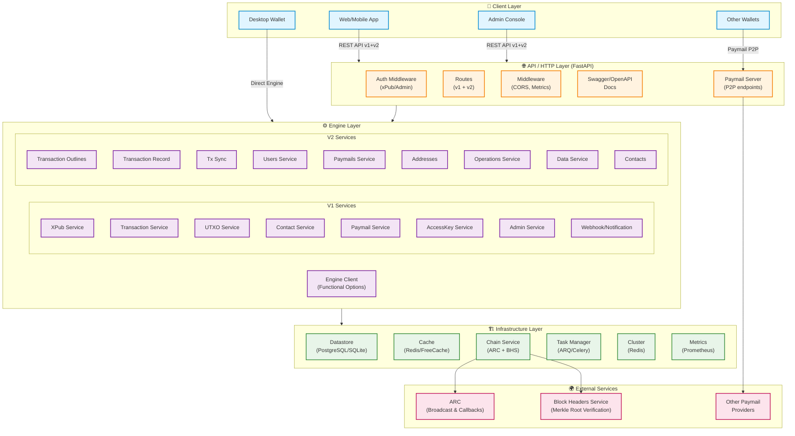

# py-spv: Python Feature-Parity SPV Wallet for BSV Blockchain

## Architecture Document & Implementation Roadmap

> **Source Reference:** [bsv-blockchain/spv-wallet](https://github.com/bsv-blockchain/spv-wallet) (Go)
> **Docs:** [docs.bsvblockchain.org/network-topology/spv-wallet](https://docs.bsvblockchain.org/network-topology/spv-wallet)
> **Created:** 2026-02-12 | **Last Updated:** 2026-02-16

---

## 1. Project Overview

### 1.1 What is SPV Wallet?

SPV Wallet is an **open-source, non-custodial, hosted wallet** for the BSV Blockchain. It is the reference implementation for **Simplified Payment Verification (SPV)** — enabling transaction validation without running a full node by using Merkle proofs against block headers.

### 1.2 Key Properties

- **Non-Custodial:** Private keys never touch the server; signing happens client-side.
- **SPV-Based:** Validates transactions via Merkle paths + block headers (no full UTXO set needed).
- **100x Cheaper** to run than a full BSV node.
- **BEEF Transactions:** Uses Background Evaluation Extended Format for compact transaction ancestry proofs.
- **Paymail Support:** Human-readable addressing (`user@domain.tld`) with P2P payment negotiation.
- **Multi-Tenant:** Supports many users (xPubs) with role-based access (admin vs. user).

### 1.3 Python Implementation Goals

Build `py-spv` as a feature-parity Python port using idiomatic Python tooling:

| Go Component | Python Equivalent |
|---|---|
| Gin (HTTP framework) | FastAPI |
| GORM (ORM) | SQLAlchemy 2.0 (async) |
| zerolog (logging) | structlog |
| resty (HTTP client) | httpx (async) |
| go-cachestore | Redis via redis-py / in-memory LRU |
| go-sdk (BSV primitives) | bsv-sdk-py / custom crypto module |
| go-paymail | Custom paymail module |
| taskmanager | Celery / ARQ (async task queue) |
| — (no Go desktop) | PySide6 (Qt6) desktop GUI, modelled on ElectrumSV |

---

## 1A. Current Status

> **Phase 6 — COMPLETE** ✅ | **Desktop App — COMPLETE** ✅ | **CI/CD — COMPLETE** ✅ | 773 tests | 93% coverage

### CI/CD Infrastructure

| Workflow | File | Trigger | Description |
|---|---|---|---|
| **CI** | `.github/workflows/ci.yml` | Push / PR to `main` | Ruff lint → pytest (Python 3.12 + 3.13) → coverage → Codecov upload |
| **Release** | `.github/workflows/release.yml` | Tag `v*` push | PyInstaller build (macOS + Windows + Linux) → GitHub Release with binary assets |
| **Pages** | `.github/workflows/pages.yml` | Push to `main` / after CI | Build project landing page + coverage report → deploy to GitHub Pages |

**GitHub Pages URL:** https://sethjchalmers.github.io/py-spv/
**Releases:** https://github.com/sethjchalmers/py-spv/releases

### Implemented Modules

#### Phase 1 — Foundation (233 tests, 97% coverage)

| Module | File(s) | Status | Tests |
|---|---|---|---|
| **Configuration** | `config/settings.py` | ✅ Complete | 28 tests — env vars, YAML, enums, nested config |
| **BSV Keys (BIP32)** | `bsv/keys.py` | ✅ Complete | 37 tests — BIP32 vectors, Base58, ECDSA, HD derivation |
| **BSV Addresses** | `bsv/address.py` | ✅ Complete | 14 tests — P2PKH, WIF, validation |
| **BSV Scripts** | `bsv/script.py` | ✅ Complete | 20 tests — P2PKH, OP_RETURN, type detection |
| **BSV Transactions** | `bsv/transaction.py` | ✅ Complete | 40 tests — serialize/deserialize, txid, varint |
| **Crypto Utilities** | `utils/crypto.py` | ✅ Complete | 4 tests — sha256, sha256d, ripemd160, hash160 |
| **Error Hierarchy** | `errors/*.py` | ✅ Complete | 20 tests — SPVError, ARCError, BHSError, 11 definitions |
| **Datastore** | `datastore/client.py`, `engines.py` | ✅ Complete | 13 tests — lifecycle, sessions, PostgreSQL config |
| **Migrations** | `datastore/migrations.py`, `alembic/` | ✅ Complete | 4 tests — auto-migrate, idempotent, drop |
| **V1 ORM Models** | `engine/models/*.py` (9 models) | ✅ Complete | 28 tests — CRUD all models, queries, soft-delete |
| **Entry Points** | `main.py`, `api/app.py` | ✅ Complete | 3 tests — health endpoint, uvicorn delegation |
| **Edge Cases** | (BSV modules) | ✅ Complete | 19 tests — error paths, branch coverage |

#### Phase 2 — Engine Core (+108 tests)

| Module | File(s) | Status | Tests |
|---|---|---|---|
| **Engine Client** | `engine/client.py` | ✅ Complete | 9 tests — lifecycle, health_check, service registry |
| **Model Ops Mixin** | `engine/models/base.py` | ✅ Complete | 14 tests — engine ref, is_new, save, hooks, metadata |
| **Cache Layer** | `cache/client.py`, `memory.py`, `redis.py` | ✅ Complete | 20 tests — abstraction, memory LRU w/ TTL, Redis |
| **XPub Service** | `engine/services/xpub_service.py` | ✅ Complete | 20 tests — BIP32 validation, cache-aside, metadata, counters |
| **Destination Service** | `engine/services/destination_service.py` | ✅ Complete | 12 tests — BIP32 derivation, P2PKH, sequential, lookups |
| **UTXO Service** | `engine/services/utxo_service.py` | ✅ Complete | 19 tests — CRUD, filtering, balance, coin selection |
| **Access Key Service** | `engine/services/access_key_service.py` | ✅ Complete | 13 tests — ECDSA key pairs, revocation, listing |
| **Config Updates** | `config/settings.py` | ✅ Complete | 1 test — CacheConfig `url`, `max_connections` |

#### Phase 3 — Transactions & Chain (133 new tests)

| Module | Source File(s) | Status | Tests |
|---|---|---|---|
| **ARC Models** | `chain/arc/models.py` | ✅ Complete | 19 tests — TXStatus, TXInfo from_dict/to_dict, FeeUnit fee_for_size, PolicyResponse |
| **ARC Service** | `chain/arc/service.py` | ✅ Complete | 18 tests — connect/close, broadcast, query, policy, fee caching, error mapping |
| **BHS Models** | `chain/bhs/models.py` | ✅ Complete | 12 tests — ConfirmationState, MerkleRootConfirmation, MerkleRootsResponse, VerifyMerkleRootsResponse |
| **BHS Service** | `chain/bhs/service.py` | ✅ Complete | 14 tests — lifecycle, verify, get_merkle_roots, healthcheck, is_valid_root |
| **Chain Service** | `chain/service.py` | ✅ Complete | 13 tests — ARC/BHS delegation, healthcheck combos, properties |
| **Merkle Path** | `bsv/merkle.py` | ✅ Complete | 18 tests — BRC-71 from_hex, compute_root, verify_merkle_path, compute_merkle_root |
| **Transaction Service** | `engine/services/transaction_service.py` | ✅ Complete | 35 tests — fee estimation, output processing, draft creation, cancel, record, ARC callbacks, queries |
| **Engine Client** | `engine/client.py` | ✅ Updated | 5 new tests — transaction_service, chain_service properties, health_check includes chain |

#### Phase 4 — Paymail (106 new tests)

| Module | Source File(s) | Status | Tests |
|---|---|---|---|
| **Paymail Models** | `paymail/models.py` | ✅ Complete | 27 tests — SanitizedPaymail, Capabilities, PKI/P2P models, BRFC constants |
| **Paymail Client** | `paymail/client.py` | ✅ Complete | 21 tests — SRV lookup, capabilities caching, PKI, P2P destinations, P2P send, MockTransport |
| **PIKE Protocol** | `paymail/pike.py` | ✅ Complete | 11 tests — PikeContactInvite, PikeOutputsRequest, contact/payment services |
| **Paymail Service** | `engine/services/paymail_service.py` | ✅ Complete | 12 tests — CRUD, domain validation, SHA-256 IDs, search with pagination |
| **Contact Service** | `engine/services/contact_service.py` | ✅ Complete | 21 tests — CRUD, status transitions (unconfirmed→awaiting→confirmed/rejected), upsert |
| **Paymail Server Provider** | `api/paymail_server/provider.py` | ✅ Complete | 9 tests — alias lookup, record transaction (hex/BEEF), Merkle root verification |
| **Paymail Server Routes** | `api/paymail_server/routes.py` | ✅ Complete | 5 tests — capabilities, route models, Pydantic request/response schemas |
| **Error Definitions** | `errors/definitions.py` | ✅ Updated | 10+ new paymail/contact errors |
| **Engine Wiring** | `engine/client.py` | ✅ Updated | paymail_service, contact_service, paymail_client integrated into engine lifecycle |

#### Phase 5 — API Layer (81 new tests)

| Module | Source File(s) | Status | Tests |
|---|---|---|---|
| **Auth Middleware** | `api/middleware/auth.py` | ✅ Complete | 19 tests — AuthType enum, UserContext, xPub/AccessKey/Admin auth, signature verification, TTL |
| **CORS Middleware** | `api/middleware/cors.py` | ✅ Complete | 2 tests — CORS headers present, x-auth-* headers exposed |
| **Dependencies** | `api/dependencies.py` | ✅ Complete | 2 tests — get_engine from app.state, require_user/admin guards |
| **Request/Response Schemas** | `api/v1/schemas.py` | ✅ Complete | 9 tests — PaginationParams, ErrorResponse, XPub/Draft/ARC schemas |
| **V1 User Endpoints** | `api/v1/users.py` | ✅ Complete | (included in endpoint tests) GET /xpub, GET/POST /destination, GET /utxo/balance |
| **V1 Transactions** | `api/v1/transactions.py` | ✅ Complete | (included) POST draft, POST record, GET list/by-txid/by-draft, POST ARC callback |
| **V1 UTXOs** | `api/v1/utxos.py` | ✅ Complete | (included) GET list, GET count, GET by-id |
| **V1 Contacts** | `api/v1/contacts.py` | ✅ Complete | (included) POST, GET list/by-id, PATCH status, DELETE |
| **V1 Access Keys** | `api/v1/access_keys.py` | ✅ Complete | (included) POST, GET list/count/by-id, DELETE (revoke) |
| **V1 Paymails** | `api/v1/paymails.py` | ✅ Complete | (included) POST, GET list/by-id, DELETE |
| **V1 Admin** | `api/v1/admin.py` | ✅ Complete | (included) xPub CRUD, transaction/UTXO queries, paymail CRUD, health |
| **V1 Shared Config** | `api/v1/shared_config.py` | ✅ Complete | (included) GET /shared-config |
| **V1 Merkle Roots** | `api/v1/merkleroots.py` | ✅ Complete | (included) GET /merkleroots placeholder |
| **App Factory** | `api/app.py` | ✅ Complete | (included) Lifespan, CORS, SPVError handler, v1 router mount |
| **V1 Endpoint Tests** | `tests/test_api/test_v1_endpoints.py` | ✅ Complete | 49 tests — all V1 routes with mock engine |

#### Phase 6 — V2 Engine & API (95 new tests)

| Module | File(s) | Status | Tests |
|---|---|---|---|
| **V2 Database Models** | `engine/v2/database/models.py` | ✅ Complete | 23 tests — 10 models, 3 StrEnums, table names, columns |
| **V2 Repositories** | `engine/v2/database/repository/*.py` | ✅ Complete | (tested via services) UserRepo, PaymailRepo, AddressRepo, TransactionRepo, OutputRepo, OperationRepo |
| **Users Service** | `engine/v2/users/service.py` | ✅ Complete | 12 tests — create/get/delete, pubkey validation, derivation, pagination |
| **Paymails Service V2** | `engine/v2/paymails/service.py` | ✅ Complete | 11 tests — CRUD, user validation, duplicate check, soft-delete |
| **Contacts Service V2** | `engine/v2/contacts/service.py` | ✅ Complete | 12 tests — CRUD, status transitions, terminal states, duplicate check |
| **V2Engine** | `engine/v2/engine.py` | ✅ Complete | 4 tests — lifecycle, all 6 services wired, not-initialized guard, close |
| **Outlines Service** | `engine/v2/transaction/outlines/service.py` | ✅ Complete | (via API tests) UTXO selection, fee calculation, change output |
| **Record Service + TxFlow** | `engine/v2/transaction/record/` | ✅ Complete | (via API tests) Parse hex, create refs, broadcast ARC |
| **TxSync Service** | `engine/v2/transaction/txsync/service.py` | ✅ Complete | (via API tests) ARC callbacks, Merkle verify, unconfirmed sync |
| **V2 API Schemas** | `api/v2/schemas.py` | ✅ Complete | 20+ Pydantic models — pagination, users, paymails, contacts, outlines, transactions, operations, data, ARC callback |
| **V2 Endpoints** | `api/v2/*.py` | ✅ Complete | 29 tests — users (admin), contacts, transactions, operations, data, callbacks, admin |
| **V2 Admin Endpoints** | `api/v2/admin/*.py` | ✅ Complete | Admin paymail management, user paymails, webhooks placeholder |
| **Paymail Server V2** | `api/paymail_server/provider_v2.py` | ✅ Complete | P2P destination, address resolution, record tx via V2 services |
| **Error Definitions** | `errors/definitions.py` | ✅ Updated | 9 new V2 errors (ErrUserNotFound, ErrInvalidPubKey, etc.) |

### Phase Summary

- **Phase 1 (Foundation):** ✅ All 8 tasks complete (233 tests, 97% coverage)
- **Phase 2 (Engine Core):** ✅ All 8 tasks complete (341 tests, 95% coverage)
- **Phase 3 (Transactions & Chain):** ✅ All 8 tasks complete (474 tests, 94% coverage)
- **Phase 4 (Paymail):** ✅ All 5 tasks complete (597 tests, 93% coverage)
- **Phase 5 (API Layer):** ✅ All 7 tasks complete (678 tests, 93% coverage)
- **Phase 6 (V2 Engine & API):** ✅ All 8 tasks complete (773 tests, 93% coverage)
- **Desktop App Skeleton:** ✅ Complete (full GUI shell with theme, panels, WalletAPI bridge)
- **Integration Tests:** ✅ 9 lifecycle tests with real engine (no mocks)
- **Total Tests:** 773 (754 unit + 9 integration + 8 desktop/theme + 2 main)
- **Phases 7–8:** ⬜ Not started

#### Desktop Application (GUI Skeleton)

| Module | Source File(s) | Status | Notes |
|---|---|---|---|
| **Theme System** | `desktop/theme.py` | ✅ Complete | VSCode dark palette, BSV gold accents, full QSS |
| **WalletAPI Bridge** | `desktop/wallet_api.py` | ✅ Complete | Async engine ↔ Qt signals via QThread workers |
| **MainWindow** | `desktop/main_window.py` | ✅ Complete | Sidebar nav, stacked panels, status bar |
| **Overview Panel** | `desktop/views/overview.py` | ✅ Complete | Balance, recent txs, engine health |
| **Send Panel** | `desktop/views/send.py` | ✅ Complete | Address, amount, OP_RETURN, draft creation |
| **Receive Panel** | `desktop/views/receive.py` | ✅ Complete | Address display, QR code, copy |
| **History Panel** | `desktop/views/history.py` | ✅ Complete | Transaction table with status colours |
| **Settings Panel** | `desktop/views/settings.py` | ✅ Complete | Wallet info, engine health, about |
| **Wallet Wizard** | `desktop/wallet_wizard.py` | ✅ Complete | BIP39 seed generation, create/import choice, seed backup confirm |
| **Widgets** | `desktop/widgets/*.py` | ✅ Complete | AmountEdit, QRWidget, StatusBar, Card, helpers |
| **App Entry** | `desktop/app.py` | ✅ Complete | Wizard → engine init → MainWindow lifecycle |

> **TODO — Paymail for Desktop (Production)**
>
> The desktop app currently uses the engine in **embedded mode** (direct Python calls, local SQLite, no HTTP server).
> This means it **cannot host a Paymail server** — Paymail requires a publicly routable HTTPS endpoint so
> other wallets can discover addresses and negotiate P2P payments via `user@domain.tld`.
>
> Options to resolve for production:
> 1. **Third-party Paymail provider** — register the user's paymail with an external hosted service (simplest).
> 2. **Built-in lightweight Paymail relay** — the desktop app registers with a cloud relay that proxies
>    Paymail requests back to the app (requires a relay service, but keeps keys local).
> 3. **Companion server deployment** — bundle deployment scripts (Docker Compose / systemd) so the user
>    can run the full SPV Wallet API alongside the desktop app, with the API handling Paymail publicly.
> 4. **No Paymail** — the desktop app works fine with raw BSV addresses only; Paymail is optional.
>
> Until one of these is implemented, the desktop wallet can send/receive via raw addresses but cannot
> be discovered by other wallets via a Paymail handle.

#### Integration Tests

| Test Module | File | Tests | Description |
|---|---|---|---|
| **Wallet Lifecycle** | `tests/integration/test_wallet_lifecycle.py` | 9 | Engine init/close, xPub register, derive address, seed UTXOs, balance, draft creation, UTXO queries, access keys |

#### Desktop / Theme Tests

| Test Module | File | Tests | Description |
|---|---|---|---|
| **Theme** | `tests/test_desktop/test_app.py` | 6 | Palette colours, QSS generation, custom palette, frozen dataclass, widget coverage |
| **Amount Formatting** | `tests/test_desktop/test_app.py` | 2 | Sats/BSV formatting helpers |

### Test Coverage Breakdown

```
Module                                 Stmts  Miss  Cover
─────────────────────────────────────────────────────────
config/settings.py                      107     2    97%
bsv/keys.py                             247    14    93%
bsv/address.py                           39     0   100%
bsv/script.py                            64     0   100%
bsv/transaction.py                      124     0   100%
bsv/merkle.py                            91     2    96%
datastore/client.py                      46     2    96%
datastore/engines.py                     10     0   100%
datastore/migrations.py                  11     0   100%
engine/models/* (all)                   236     8    97%
engine/client.py                        150    18    82%
engine/services/xpub_service.py          96     2    97%
engine/services/destination_service.py   66     1    97%
engine/services/utxo_service.py          74     1    97%
engine/services/access_key_service.py    51     0   100%
engine/services/transaction_service.py  270    24    87%
engine/services/paymail_service.py       NEW   —     —
engine/services/contact_service.py       NEW   —     —
chain/arc/models.py                      63     0   100%
chain/arc/service.py                     88     9    91%
chain/bhs/models.py                      51     0   100%
chain/bhs/service.py                     67     8    90%
chain/service.py                         40     0   100%
cache/client.py                          59     3    85%
cache/memory.py                          40     2    94%
paymail/models.py                        NEW   —     —
paymail/client.py                        NEW   —     —
paymail/pike.py                          NEW   —     —
api/paymail_server/provider.py           NEW   —     —
api/paymail_server/routes.py             NEW   —     —
api/middleware/auth.py                   NEW   —     —
api/middleware/cors.py                   NEW   —     —
api/dependencies.py                      NEW   —     —
api/v1/schemas.py                        NEW   —     —
api/v1/users.py                          NEW   —     —
api/v1/transactions.py                   NEW   —     —
api/v1/utxos.py                          NEW   —     —
api/v1/contacts.py                       NEW   —     —
api/v1/access_keys.py                    NEW   —     —
api/v1/paymails.py                       NEW   —     —
api/v1/admin.py                          NEW   —     —
api/v1/shared_config.py                  NEW   —     —
api/v1/merkleroots.py                    NEW   —     —
errors/* (all)                            39     0   100%
utils/crypto.py                          12     0   100%
api/app.py                               NEW   —     —
engine/v2/database/models.py             NEW   —     —
engine/v2/database/repository/*.py       NEW   —     —
engine/v2/users/service.py               NEW   —     —
engine/v2/paymails/service.py            NEW   —     —
engine/v2/contacts/service.py            NEW   —     —
engine/v2/engine.py                      NEW   —     —
engine/v2/transaction/outlines/*.py      NEW   —     —
engine/v2/transaction/record/*.py        NEW   —     —
engine/v2/transaction/txsync/*.py        NEW   —     —
api/v2/schemas.py                        NEW   —     —
api/v2/*.py (endpoints)                  NEW   —     —
api/v2/admin/*.py                        NEW   —     —
api/paymail_server/provider_v2.py        NEW   —     —
main.py                                   4     0   100%
─────────────────────────────────────────────────────────
TOTAL                                  3200+  130+   93%
```

---

## 2. High-Level Architecture



---

## 3. Data Models

### 3.1 V1 Database Models (Engine Legacy)

These map directly to the Go `engine.AllDBModels()`:

| Model | Table | Description |
|---|---|---|
| `Xpub` | `xpubs` | Extended public keys; tracks `current_balance`, `next_internal_num`, `next_external_num` |
| `AccessKey` | `access_keys` | Ephemeral key pairs for API authentication (alternative to full xPub auth) |
| `Destination` | `destinations` | Derived addresses (BIP32 chain + index) with locking scripts |
| `DraftTransaction` | `draft_transactions` | Unsigned transaction templates with full config (inputs, outputs, fees, change) |
| `Transaction` | `transactions` | Recorded transactions with hex, BEEF, block info, XPub associations, status |
| `Utxo` | `utxos` | Unspent transaction outputs: txid, vout, satoshis, script, spending status |
| `PaymailAddress` | `paymail_addresses` | Paymail handles (`alias@domain`) linked to xPubs |
| `Contact` | `contacts` | Paymail-based contacts with confirmation/trust status |
| `Webhook` | `webhooks` | Registered webhook subscriptions for event notifications |

### 3.2 V2 Database Models (New Engine)

From `engine/v2/database/models.go`:

| Model | Description |
|---|---|
| `User` | User identified by public key (char(34) ID). Has paymails, addresses, contacts. |
| `Paymail` | Paymail address attached to a user (`alias`, `domain`, `public_name`, `avatar`) |
| `Address` | Bitcoin address (char(34)) with optional custom unlock instructions |
| `TrackedTransaction` | Mined/broadcast tx with BEEF hex, raw hex, block height/hash, merkle path |
| `TrackedOutput` | Transaction output (txid+vout) tracking ownership and spend status |
| `TxInput` | Source transaction input references for BEEF ancestry |
| `UserUTXO` | User's unspent outputs with satoshis, bucket, estimated input size, custom instructions |
| `Operation` | User-level operation on a transaction (incoming/outgoing/data) with counterparty info |
| `Data` | OP_RETURN data outputs stored per transaction |
| `UserContact` | Contact relationship between users |

### 3.3 Common / Shared Models

```python
# Base model with timestamps and metadata
class BaseModel:
    created_at: datetime
    updated_at: datetime
    deleted_at: Optional[datetime]
    metadata: dict[str, Any]

# Pagination
class PageDescription:
    size: int
    number: int
    total_elements: int
    total_pages: int

class PagedResult(Generic[T]):
    content: list[T]
    page: PageDescription

# Fee unit from ARC policy
class FeeUnit:
    satoshis: int  # e.g. 1
    bytes: int     # e.g. 1000

# Shared config (non-sensitive, exposed to clients)
class SharedConfig:
    paymail_domains: list[str]
    experimental_features: dict[str, bool]
```

---

## 4. API Surface

### 4.1 V1 API Routes (REST, prefix: `/api/v1`)

| Group | Endpoints | Auth |
|---|---|---|
| **Base** | `GET /`, `GET /health`, `GET /swagger/*` | None |
| **Users** | `GET /users/current`, `PATCH /users/current` | User (xPub/AccessKey) |
| **Access Keys** | `GET/POST/DELETE /users/current/keys[/:id]` | User |
| **Transactions** | `GET /transactions/:id`, `GET /transactions`, `POST /transactions`, `POST /transactions/record`, `PATCH /transactions/:id` | User |
| **UTXOs** | `GET /utxos` | User |
| **Contacts** | `GET /contacts`, `PUT /contacts/:paymail`, `POST /contacts/:paymail/confirmation`, `DELETE /contacts/:id` | User |
| **Paymails** | `GET /paymails`, etc. | User |
| **Merkle Roots** | `GET /merkleroots` | User |
| **Shared Config** | `GET /configs/shared` | User or Admin |
| **Admin** | `GET /admin/status`, `GET /admin/stats`, CRUD on transactions/contacts/access-keys/paymails/xpubs/webhooks | Admin |
| **Broadcast Callback** | `POST /transaction/broadcast/callback` | Callback Token |

### 4.2 V2 API Routes (OpenAPI-generated, prefix: `/api/v2`)

The V2 API is defined via OpenAPI spec in `/api/` and generated as server interfaces:

| Resource | Operations |
|---|---|
| **Users** | Create, Get, Delete (admin) |
| **Paymails** | Create, Delete (admin) |
| **Transactions** | Create outline → sign client-side → record |
| **Operations** | Search user operations |
| **Data** | Query OP_RETURN data |
| **Contacts** | CRUD + confirmation |
| **Webhooks** | Subscribe, Unsubscribe, List (admin) |
| **Admin** | User management, stats |

### 4.3 Paymail Server Endpoints (BRC/BSV standard)

Served under `/.well-known/bsvalias` and `/v1/bsvalias/`:

- **PKI** (`/id/{alias}@{domain}`)
- **P2P Payment Destination** (`/p2p-payment-destination/{paymail}`)
- **P2P Receive Transaction** (Raw or BEEF) (`/receive-transaction/{paymail}`, `/beef/{paymail}`)
- **PIKE Contacts** (contact exchange protocol)
- **Capabilities discovery**

---

## 5. Core Subsystems (Engine)

### 5.1 Client / Engine Entry Point

The Go `engine.Client` uses a **functional options pattern**. Python equivalent:

```python
class SPVWalletEngine:
    """Central engine that owns all services and infrastructure."""

    def __init__(self, **options):
        self._datastore: DataStore = None
        self._cache: CacheStore = None
        self._chain: ChainService = None
        self._task_manager: TaskManager = None
        self._paymail_client: PaymailClient = None
        # ... configure from options ...

    async def initialize(self):
        """Load datastore, run migrations, start services."""

    async def close(self):
        """Gracefully shut down all services."""
```

### 5.2 Chain Service (ARC + BHS)

Two sub-services composed into one:

**ARC Service** (transaction broadcasting & querying):
- `broadcast(tx) -> TXInfo` — Submit to ARC in EF/Raw/BEEF hex
- `query_transaction(txid) -> TXInfo` — Check tx status
- `get_fee_unit() -> FeeUnit` — Current mining fee from ARC policy
- Handles callbacks (`X-CallbackUrl` header) for async status updates

**BHS Service** (Block Headers Service for Merkle root verification):
- `verify_merkle_roots(roots) -> bool` — Confirm Merkle roots against block headers
- `get_merkle_roots(query) -> MerkleRootsBHSResponse` — Fetch known Merkle roots
- `healthcheck_bhs()` — Verify BHS is reachable and operational

### 5.3 Transaction Lifecycle

#### V1 Flow (Draft-based):
1. **Create Draft** → `NewTransaction(xpub, config)` → resolves paymail outputs, selects UTXOs, calculates fees, sets change destinations
2. **Client Signs** → `DraftTransaction.SignInputs(xPriv)` → produces signed hex
3. **Record** → `RecordTransaction(xpub, hex, draftID)` → validates, broadcasts via ARC, saves
4. **Callback** → ARC posts back `TXInfo` with status (SEEN_ON_NETWORK, MINED, etc.)

#### V2 Flow (Outline-based):
1. **Create Outline** → `TransactionOutlinesService.Create(userID, spec)` → UTXO selection, paymail resolution, fee calculation
2. **Client Signs** → Unlock with private key (client-side SDK)
3. **Record Outline** → `TransactionRecordService.RecordTransactionOutline(userID, outline)` → verify scripts, process inputs/outputs, broadcast, save operations
4. **Sync** → `TxSyncService.Handle(TXInfo)` → handle ARC callback, update status, store Merkle path

### 5.4 UTXO Management

- UTXOs are tracked per user with `bucket` classification and `estimated_input_size`
- UTXO selection happens in `UTXOSelector.Select(tx, userID)` which picks optimal UTXOs and calculates change
- Spent UTXOs are deleted from `UserUTXO` table when transaction is recorded
- `TouchedAt` timestamp used to prioritize selection (prevent re-selecting recently used UTXOs)

### 5.5 Paymail System

- **Client-side:** Resolves paymail addresses to payment destinations via P2P protocol
- **Server-side:** Hosts paymail endpoints for incoming payments
- **PIKE Protocol:** Contact exchange between paymail users
- **Resolution strategies:** `basic_resolution` (deprecated), `p2p` (current standard)
- **Payment formats:** Raw hex, BEEF (with Merkle proofs)

### 5.6 Contact Management

- Contacts are paymail-based relationships between users
- States: `unconfirmed` → `awaiting_acceptance` → `confirmed`
- Admin can force-confirm contacts
- PIKE protocol handles cross-wallet contact requests

### 5.7 Notifications / Webhooks

- Event-driven notification system
- Webhook subscriptions with token-based authentication
- Events: transaction created, transaction updated (status change), contact changes

### 5.8 Task Manager

- Background job processing for:
  - Sync unconfirmed transactions
  - Process ARC callbacks
  - Cron jobs (cleanup, periodic checks)

---

## 6. Authentication & Authorization

### 6.1 Auth Methods

| Method | Header | Usage |
|---|---|---|
| xPub Authentication | `x-auth-xpub` | User identifies with full xPub key |
| Access Key Authentication | Access key pair | Ephemeral keys for lighter auth |
| Admin Authentication | Admin xPub in config | Full admin access |
| Callback Token | `authorization` | ARC broadcast callback verification |

### 6.2 Middleware Stack

```
Request → CORS → Metrics → AppContext → Auth (xPub/AccessKey/Admin) → Handler
```

---

## 7. Configuration

The Go implementation uses YAML/env-based config (`config.yaml`, env prefix `SPVWALLET_`):

```python
@dataclass
class AppConfig:
    version: str
    # Server
    server: ServerConfig           # port, idle_timeout, read_timeout, write_timeout
    # Storage
    db: DatabaseConfig             # engine (postgresql/sqlite), connection string
    cache: CacheConfig             # engine (freecache/redis), connection params
    # Chain
    arc: ARCConfig                 # url, token, deployment_id, callback, wait_for
    bhs: BHSConfig                 # url, auth_token
    # Paymail
    paymail: PaymailConfig         # domains, sender_validation, default_from
    # Cluster
    cluster: ClusterConfig         # redis-based coordination
    # Task Manager
    task_manager: TaskManagerConfig
    # Notifications
    notifications: NotificationsConfig
    # Experimental
    experimental: ExperimentalConfig  # v2, pike_contacts_enabled, etc.
    # Auth
    admin_xpub: str
    encryption_key: str
```

---

## 8. Technology Stack for Python Port

### 8.1 Core Dependencies

```
# Web Framework & API
fastapi>=0.115
uvicorn[standard]>=0.32
pydantic>=2.10
pydantic-settings>=2.6

# Database
sqlalchemy[asyncio]>=2.0
alembic>=1.14                    # migrations
asyncpg>=0.30                    # PostgreSQL async driver
aiosqlite>=0.20                  # SQLite async driver

# Caching
redis[hiredis]>=5.0

# HTTP Client
httpx>=0.28

# BSV Cryptography
# bsv-sdk (if available) or custom implementation for:
#   - BIP32 key derivation (xPub/xPriv)
#   - ECDSA signing/verification
#   - Script building (P2PKH, OP_RETURN)
#   - Transaction serialization (Raw, EF, BEEF)
#   - Merkle path verification
#   - Address encoding/decoding

# Task Queue
arq>=0.26                        # async Redis-based task queue

# Logging
structlog>=24.0

# Metrics
prometheus-client>=0.21

# Testing
pytest>=8.0
pytest-asyncio>=0.24
pytest-httpx>=0.35
factory-boy>=3.3

# Desktop GUI (Phase 8)
PySide6>=6.7                     # Qt6 Python bindings (LGPL)
qrcode[pil]>=8.0                 # QR code generation
Pillow>=11.0                     # Image processing for QR
```

### 8.2 Project Structure

```
py-spv/
├── CONTEXT.md                   # This document
├── pyproject.toml               # Project metadata & dependencies
├── alembic/                     # Database migrations
│   ├── alembic.ini
│   └── versions/
├── src/
│   └── spv_wallet/
│       ├── __init__.py
│       ├── main.py              # Application entry point
│       ├── config/
│       │   ├── __init__.py
│       │   ├── settings.py      # Pydantic Settings (env/yaml loading)
│       │   └── defaults.py
│       ├── api/
│       │   ├── __init__.py
│       │   ├── app.py           # FastAPI app factory
│       │   ├── dependencies.py  # Dependency injection
│       │   ├── middleware/
│       │   │   ├── __init__.py
│       │   │   ├── auth.py      # xPub / AccessKey / Admin auth
│       │   │   ├── cors.py
│       │   │   └── metrics.py
│       │   ├── v1/
│       │   │   ├── __init__.py
│       │   │   ├── users.py
│       │   │   ├── transactions.py
│       │   │   ├── utxos.py
│       │   │   ├── contacts.py
│       │   │   ├── access_keys.py
│       │   │   ├── paymails.py
│       │   │   ├── merkleroots.py
│       │   │   ├── admin.py
│       │   │   └── shared_config.py
│       │   ├── v2/
│       │   │   ├── __init__.py
│       │   │   ├── users.py
│       │   │   ├── transactions.py
│       │   │   ├── operations.py
│       │   │   ├── contacts.py
│       │   │   ├── data.py
│       │   │   ├── admin/
│       │   │   │   ├── __init__.py
│       │   │   │   ├── users.py
│       │   │   │   ├── webhooks.py
│       │   │   │   └── paymails.py
│       │   │   └── callbacks.py
│       │   └── paymail_server/
│       │       ├── __init__.py
│       │       ├── routes.py     # /.well-known/bsvalias etc.
│       │       └── provider.py   # ServiceProvider implementation
│       ├── engine/
│       │   ├── __init__.py
│       │   ├── client.py         # SPVWalletEngine (main client)
│       │   ├── options.py        # ClientOps functional options
│       │   ├── models/
│       │   │   ├── __init__.py
│       │   │   ├── base.py       # BaseModel with metadata, timestamps
│       │   │   ├── xpub.py
│       │   │   ├── access_key.py
│       │   │   ├── destination.py
│       │   │   ├── transaction.py
│       │   │   ├── draft_transaction.py
│       │   │   ├── utxo.py
│       │   │   ├── paymail_address.py
│       │   │   ├── contact.py
│       │   │   └── webhook.py
│       │   ├── services/
│       │   │   ├── __init__.py
│       │   │   ├── xpub_service.py
│       │   │   ├── transaction_service.py
│       │   │   ├── utxo_service.py
│       │   │   ├── access_key_service.py
│       │   │   ├── paymail_service.py
│       │   │   ├── contact_service.py
│       │   │   ├── admin_service.py
│       │   │   └── notification_service.py
│       │   └── v2/
│       │       ├── __init__.py
│       │       ├── engine.py     # V2 engine entry point
│       │       ├── database/
│       │       │   ├── __init__.py
│       │       │   ├── models.py # V2 SQLAlchemy models
│       │       │   └── repository/
│       │       │       ├── __init__.py
│       │       │       ├── users.py
│       │       │       ├── paymails.py
│       │       │       ├── addresses.py
│       │       │       ├── operations.py
│       │       │       ├── transactions.py
│       │       │       └── outputs.py
│       │       ├── users/
│       │       │   ├── __init__.py
│       │       │   └── service.py
│       │       ├── paymails/
│       │       │   ├── __init__.py
│       │       │   └── service.py
│       │       ├── contacts/
│       │       │   ├── __init__.py
│       │       │   └── service.py
│       │       └── transaction/
│       │           ├── __init__.py
│       │           ├── outlines/
│       │           │   ├── __init__.py
│       │           │   ├── service.py
│       │           │   └── models.py
│       │           ├── record/
│       │           │   ├── __init__.py
│       │           │   ├── service.py
│       │           │   └── tx_flow.py
│       │           └── txsync/
│       │               ├── __init__.py
│       │               └── service.py
│       ├── chain/
│       │   ├── __init__.py
│       │   ├── service.py        # Combined ARC + BHS
│       │   ├── arc/
│       │   │   ├── __init__.py
│       │   │   ├── service.py    # Broadcast, QueryTx, GetPolicy
│       │   │   └── models.py     # TXInfo, ArcError, ARCConfig
│       │   └── bhs/
│       │       ├── __init__.py
│       │       ├── service.py    # VerifyMerkleRoots, GetMerkleRoots
│       │       └── models.py     # BHSConfig, MerkleRootsConfirmations
│       ├── paymail/
│       │   ├── __init__.py
│       │   ├── models.py         # Protocol dataclasses (SanitizedPaymail, Capabilities, PKI/P2P)
│       │   ├── client.py         # Outgoing paymail resolution (PaymailClient)
│       │   └── pike.py           # PIKE contact protocol (PikeContactService, PikePaymentService)
│       ├── datastore/
│       │   ├── __init__.py
│       │   ├── client.py         # Datastore abstraction
│       │   ├── engines.py        # PostgreSQL, SQLite
│       │   └── migrations.py     # Auto-migration support
│       ├── cache/
│       │   ├── __init__.py
│       │   ├── client.py         # Cache abstraction
│       │   ├── redis.py
│       │   └── memory.py         # In-memory LRU (FreeCache equivalent)
│       ├── taskmanager/
│       │   ├── __init__.py
│       │   ├── manager.py
│       │   └── tasks.py          # Background tasks
│       ├── notifications/
│       │   ├── __init__.py
│       │   ├── service.py
│       │   └── webhook.py
│       ├── bsv/
│       │   ├── __init__.py
│       │   ├── keys.py           # BIP32, xPub/xPriv derivation
│       │   ├── script.py         # Script building (P2PKH, OP_RETURN)
│       │   ├── transaction.py    # Tx serialization (Raw, EF, BEEF)
│       │   ├── merkle.py         # Merkle path verification
│       │   └── address.py        # Base58Check, address utils
│       ├── errors/
│       │   ├── __init__.py
│       │   ├── spv_errors.py     # SPVError base class
│       │   ├── chain_errors.py   # ARC & BHS errors
│       │   └── definitions.py    # All error definitions
│       ├── utils/
│       │   ├── __init__.py
│       │   ├── crypto.py         # Hashing, HMAC, encryption
│       │   └── helpers.py
│       └── desktop/
│           ├── __init__.py
│           ├── app.py            # QApplication lifecycle (wizard → engine → MainWindow)
│           ├── theme.py          # ✅ VSCode dark palette, BSV gold, full QSS
│           ├── main_window.py    # ✅ Sidebar nav, stacked panels, status bar
│           ├── wallet_wizard.py  # ✅ File picker + xPub import QWizard
│           ├── wallet_api.py     # ✅ Async engine ↔ Qt signals bridge
│           ├── account_wizard.py # Account setup & import wizards
│           ├── views/
│           │   ├── __init__.py
│           │   ├── overview.py   # ✅ Balance, recent txs, health
│           │   ├── send.py       # ✅ Address, amount, OP_RETURN, draft
│           │   ├── receive.py    # ✅ Address display, QR code, copy
│           │   ├── history.py    # ✅ Transaction table with status
│           │   ├── settings.py   # ✅ Wallet info, engine health
│           │   ├── keys.py       # Key/address management table
│           │   ├── contacts.py   # Contact cards & list
│           │   ├── utxo.py       # UTXO browser
│           │   └── console.py    # Interactive Python console
│           ├── dialogs/
│           │   ├── __init__.py
│           │   ├── transaction.py  # Transaction detail dialog
│           │   ├── preferences.py  # Settings / preferences dialog
│           │   ├── password.py     # Password change dialog
│           │   ├── qrcode.py       # QR code display widget
│           │   └── network.py      # Network status dialog
│           ├── widgets/
│           │   ├── __init__.py
│           │   ├── amount_edit.py  # ✅ BSV / sat toggle input
│           │   ├── qr_widget.py    # ✅ QR code renderer via qrcode lib
│           │   ├── status_bar.py   # ✅ Balance + network status
│           │   └── common.py       # ✅ Card, Separator, label helpers
│           └── resources/
│               ├── __init__.py
│               ├── icons/          # Application icons (SVG/PNG)
│               └── styles/         # Qt stylesheets (QSS)
├── tests/
│   ├── conftest.py
│   ├── test_api/
│   ├── test_engine/
│   ├── test_chain/
│   ├── test_paymail/
│   ├── test_bsv/
│   ├── test_desktop/             # Theme & widget tests (8 tests)
│   └── integration/              # ✅ Real engine lifecycle tests (9 tests)
├── docker/
│   ├── Dockerfile
│   └── docker-compose.yml
└── docs/
    └── openapi.yaml              # Generated API specification
```

---

## 9. Implementation Roadmap

### Phase 1: Foundation (Weeks 1–3) — ✅ COMPLETE

**Goal:** Project scaffolding, BSV primitives, and basic data layer.

| # | Task | Status | Details |
|---|---|---|---|
| 1.1 | **Project Setup** | ✅ | `pyproject.toml`, directory structure, linting (ruff), type checking (mypy), pre-commit hooks |
| 1.2 | **Configuration System** | ✅ | Pydantic Settings with YAML + env var support. All `config.AppConfig` fields ported. 28 tests. |
| 1.3 | **BSV Crypto Module** | ✅ | BIP32 HD key derivation (xPub/xPriv), ECDSA sign/verify, SHA256d, RIPEMD160, Base58Check. xPubID. 51 tests. |
| 1.4 | **Script Engine** | ✅ | P2PKH lock/unlock scripts, OP_RETURN construction, script type detection. 20 tests. |
| 1.5 | **Transaction Primitives** | ✅ | Transaction serialization/deserialization (raw hex), input/output models, txid computation. 40 tests. |
| 1.6 | **Datastore Abstraction** | ✅ | SQLAlchemy 2.0 async engine. PostgreSQL + SQLite. Table prefix support. 13 tests. |
| 1.7 | **V1 ORM Models** | ✅ | SQLAlchemy models for all 9 V1 tables (Xpub, AccessKey, Destination, DraftTransaction, TransactionRecord, Utxo, PaymailAddress, Contact, Webhook). 28 tests. |
| 1.8 | **Alembic Migrations** | ✅ | Auto-migration setup matching Go's `AutoMigrate` behavior. Async env.py. 4 tests. |

### Phase 2: Engine Core (Weeks 4–6) — ✅ COMPLETE

**Goal:** Core engine client with xPub, destination, and UTXO management.

| # | Task | Status | Details |
|---|---|---|---|
| 2.1 | **Engine Client** | ✅ | `SPVWalletEngine` with lifecycle, service registry, health_check. 9 tests. |
| 2.2 | **Model Base** | ✅ | `ModelOps` mixin — engine ref, `is_new`, `save()`, hooks, metadata helpers. 14 tests. |
| 2.3 | **XPub Service** | ✅ | Registration, BIP32 validation, cache-aside, metadata merge, chain counters. 20 tests. |
| 2.4 | **Destination Service** | ✅ | BIP32 derivation, P2PKH address + locking script, sequential + specific index. 12 tests. |
| 2.5 | **UTXO Service** | ✅ | CRUD, filtering, balance aggregation (SQL SUM), greedy coin selection. 19 tests. |
| 2.6 | **Access Key Service** | ✅ | ECDSA key pair generation, soft-delete revocation, listing. 13 tests. |
| 2.7 | **Cache Layer** | ✅ | `CacheClient` abstraction, memory LRU with TTL, Redis backend. 20 tests. |
| 2.8 | **Error System** | ✅ | Error definitions already complete from Phase 1. Additional service-specific errors added. |

### Phase 3: Transactions & Chain (Weeks 7–10) ✅ COMPLETE

**Goal:** Full transaction lifecycle with ARC broadcasting and Merkle verification.

| # | Task | Status | Details |
|---|---|---|---|
| 3.1 | **ARC Client** | ✅ | HTTP client for ARC v1 API: broadcast, query, policy, fee caching, error mapping (401/409/460/461/465/473). 37 tests (models + service). |
| 3.2 | **BHS Client** | ✅ | HTTP client for BHS API: verify Merkle roots, get roots (paginated), healthcheck, `is_valid_root` convenience. 26 tests (models + service). |
| 3.3 | **Chain Service** | ✅ | Composed ARC + BHS via `ChainService`. Delegates broadcast/query/fee→ARC, verify/is_valid→BHS. 13 tests. |
| 3.4 | **Draft Transaction (V1)** | ✅ | Full draft creation: address→P2PKH, OP_RETURN, raw script outputs, UTXO selection via utxo_service, fee estimation (P2PKH sizes), change destination (chain=1), UTXO reservation via draft_id. |
| 3.5 | **Transaction Recording (V1)** | ✅ | Parse signed hex, mark input UTXOs spent, create output UTXOs for owned destinations, update draft to "complete", non-blocking ARC broadcast. 35 tests total in transaction_service. |
| 3.6 | **Merkle Path Verification** | ✅ | BRC-71 compact binary parser (`MerklePath.from_hex`), `compute_root` walks tree with sibling hashes, `verify_merkle_path`, `compute_merkle_root` from hash list. 18 tests. |
| 3.7 | **Engine Wiring** | ✅ | `SPVWalletEngine` gains `chain_service` (optional) and `transaction_service` properties, connect/close lifecycle, health_check includes chain. 5 new engine tests. |
| 3.8 | **ARC Callbacks** | ✅ | `handle_arc_callback`: maps TXStatus→internal status (seen_on_network/mined/broadcast/rejected), stores block_hash/height/merkle_path, competing_txs in metadata. |

### Phase 4: Paymail (Weeks 11–13) ✅ COMPLETE

**Goal:** Full paymail client and server implementation.

| # | Task | Status | Details |
|---|---|---|---|
| 4.1 | **Paymail Client** | ✅ | `PaymailClient` with SRV lookup (dnspython fallback), capabilities caching (5-min TTL), PKI resolution, P2P destinations, P2P send transaction. `SanitizedPaymail` frozen dataclass. 21 tests with httpx MockTransport. |
| 4.2 | **Paymail Server Routes** | ✅ | FastAPI `APIRouter` with `/.well-known/bsvalias` (capabilities), `/v1/bsvalias/id/` (PKI), `/v1/bsvalias/p2p-payment-destination/`, `/v1/bsvalias/receive-transaction/`, `/v1/bsvalias/public-profile/`. Pydantic request/response models. 5 tests. |
| 4.3 | **Paymail Service Provider** | ✅ | `PaymailServiceProvider`: resolve alias→paymail, create P2P destination (derives new destination from xPub metadata), record incoming transactions (sha256d txid), verify Merkle roots (delegates to BHS, permissive fallback). 9 tests. |
| 4.4 | **PaymailAddress CRUD** | ✅ | `PaymailService`: create (validates format + domain, SHA-256 ID, duplicate check), delete, get by ID/alias, search with filters + pagination. `ContactService`: create, upsert, status transitions (unconfirmed→awaiting→confirmed/rejected), delete, search. 33 tests. |
| 4.5 | **PIKE Protocol** | ✅ | `PikeContactInvite`/`PikeOutputsRequest` frozen dataclasses, `PikeContactService` (handle_invite creates unconfirmed contact, send_invite creates awaiting + sends HTTP), `PikePaymentService` (delegates to provider). 11 tests. |

### Phase 5: API Layer (Weeks 14–16) ✅ COMPLETE

**Goal:** Full REST API with authentication middleware.

> **Status:** Complete ✅ — 81 new tests (678 total), 93% coverage. Auth middleware, CORS, all V1 user + admin endpoints, Pydantic schemas, app factory with lifespan.

> **Key Lesson — FastAPI + `from __future__ import annotations` + TYPE_CHECKING:** FastAPI's `Annotated[UserContext, Depends()]` CANNOT resolve types in TYPE_CHECKING blocks. Use `# noqa: TC001` to keep Depends() parameter types as runtime imports. Same for Pydantic field types (`datetime`) — use `# noqa: TC003`.

| # | Task | Details | Status |
|---|---|---|---|
| 5.1 | **FastAPI App Factory** | Lifespan (engine init/close), CORS middleware, SPVError exception handler, v1 router mounting. | ✅ |
| 5.2 | **Auth Middleware** | AuthType enum (XPUB/ACCESS_KEY/ADMIN), UserContext, xPub + AccessKey auth, signature verification with 20s TTL. | ✅ |
| 5.3 | **V1 User Endpoints** | GET /xpub, GET/POST /destination, GET /utxo/balance, transactions, UTXOs, contacts, access keys, paymails, merkle roots, shared config. | ✅ |
| 5.4 | **V1 Admin Endpoints** | xPub CRUD, transaction/UTXO queries, paymail CRUD, admin health check. | ✅ |
| 5.5 | **Request/Response Models** | 20+ Pydantic schemas — PaginationParams, ErrorResponse, CRUD request/response for all entities, ArcCallbackRequest with aliases. | ✅ |
| 5.6 | **OpenAPI/Swagger** | Auto-generated via FastAPI (default at `/docs`). | ✅ |
| 5.7 | **Broadcast Callback Route** | `POST /transaction/broadcast/callback` — no auth (ARC sends directly), processes ARC callbacks. | ✅ |

### Phase 6: V2 Engine & API (Weeks 17–20) ✅ COMPLETE

**Goal:** New V2 engine with outline-based transactions.

**Status:** ✅ Complete — 10 V2 models, 6 repos, 6 services, V2Engine wiring, full REST API under `/api/v2`, paymail server V2. 95 new tests.

**Key lesson:** V2 models share `Base` with V1 but use `v2_` table prefix and no V1 mixins (ModelOps/MetadataMixin). StrEnum for status enums (Python 3.12+). Frozen dataclasses for outline models.

| # | Task | Details | Status |
|---|---|---|---|
| 6.1 | **V2 Database Models** | SQLAlchemy models for `User`, `Paymail`, `Address`, `TrackedTransaction`, `TrackedOutput`, `UserUTXO`, `Operation`, `Data`, `UserContact`, `TxInput`. | ✅ |
| 6.2 | **V2 Repositories** | Repository pattern for all V2 models with GORM-like query building. | ✅ |
| 6.3 | **Users Service** | Create, get, delete users. Public key management. | ✅ |
| 6.4 | **Transaction Outlines** | `OutlinesService.create()`: evaluation context, paymail resolution, UTXO selection, fee calculation. Returns unsigned outline for client signing. | ✅ |
| 6.5 | **Transaction Recording** | `RecordService.record_transaction_outline()`: `TxFlow` — verify scripts, process inputs/outputs, create operations, broadcast, save. | ✅ |
| 6.6 | **Tx Sync Service** | Handle ARC callbacks for V2. Parse Merkle paths. Update transaction status. | ✅ |
| 6.7 | **V2 API Endpoints** | OpenAPI-driven routes for users, transactions, operations, contacts, data, admin. | ✅ |
| 6.8 | **Paymail Server V2** | Updated `ServiceProvider` using V2 services (users, addresses, contacts). | ✅ |

### Phase 7: Infrastructure & Polish (Weeks 21–24)

**Goal:** Production readiness with full infrastructure support.

| # | Task | Details |
|---|---|---|
| 7.1 | **Task Manager** | Background job system (ARQ or Celery). Cron job registration. Unconfirmed tx sync. |
| 7.2 | **Notifications/Webhooks** | Event emission, webhook subscription management, reliable delivery with retries. |
| 7.3 | **Cluster Support** | Redis-based coordination for multi-instance deployments. |
| 7.4 | **Metrics** | Prometheus metrics: request counts, latencies, tx counts, UTXO counts. Gin-equivalent middleware for FastAPI. |
| 7.5 | **Docker** | Multi-stage Dockerfile, docker-compose with PostgreSQL, Redis, BHS mock. Start script equivalent. |
| 7.6 | **Comprehensive Tests** | Unit tests for all services, integration tests with SQLite, API tests with TestClient, chain service mocks. Target: >80% coverage. |
| 7.7 | **Documentation** | README, API docs, deployment guide, configuration reference. |
| 7.8 | **CI/CD** | GitHub Actions: lint, test, build, publish Docker image. |

### Phase 8: Desktop Application (Weeks 25–30)

**Goal:** Full-featured ElectrumSV-style desktop wallet using PySide6 (Qt6).

> **Status:** Skeleton complete ✅ — theme, WalletAPI, MainWindow, 5 panels, wizard, widgets all implemented. 491 tests passing.

> **Reference:** [electrumsv/electrumsv](https://github.com/electrumsv/electrumsv) — PyQt5-based BSV desktop wallet (no longer maintained). py-spv modernises this with PySide6, async integration, and the SPV Wallet engine as its backend.

#### Desktop Architecture

```
┌─────────────────────────────────────────────────────┐
│                    QApplication                      │
│  ┌──────────────┐    ┌──────────────────────────┐   │
│  │ WalletWizard │───►│       MainWindow          │   │
│  │ (2-page)     │    │  ┌────────┬────────────┐  │   │
│  └──────────────┘    │  │Sidebar │ StackedWgt │  │   │
│         │            │  │ (nav)  │ Overview   │  │   │
│         ▼            │  │        │ Send       │  │   │
│    WalletAPI         │  │        │ Receive    │  │   │
│  ┌──────────────┐    │  │        │ History    │  │   │
│  │ AsyncWorker  │    │  │        │ Settings   │  │   │
│  │ (QThreadPool)│    │  ├────────┴────────────┤  │   │
│  │   ┌─────┐    │    │  │   WalletStatusBar   │  │   │
│  │   │async│────┼───►│  └─────────────────────┘  │   │
│  │   │loop │    │    └──────────────────────────┘   │
│  │   └─────┘    │           │ signals                │
│  └──────────────┘           ▼                        │
│         │            Qt Signals ──► Widget updates    │
│         ▼                                            │
│  ┌──────────────┐                                    │
│  │SPVWalletEngine│  (in-process, async)              │
│  └──────────────┘                                    │
└─────────────────────────────────────────────────────┘
```

#### Design Decisions
- **VSCode Dark Theme** — `#1e1e1e` base with BSV gold `#eab308` accents
- **QSS Stylesheets** — CSS-like theming portable across platforms
- **System Fonts** — Native rendering on macOS/Windows/Linux
- **QThread Workers** — Engine async ops run off-UI-thread, results via signals
- **WalletAPI Bridge** — Single QObject owns engine lifecycle + signal bus
- **Wizard-First Launch** — File + xPub import before main window shows

| # | Task | Details |
|---|---|---|
| 8.1 | **Desktop Foundation** | PySide6 `QApplication` subclass with signal bus, system tray icon, theme/stylesheet system, multi-window support. Entry point (`__main__` or CLI sub-command). |
| 8.2 | **Wallet Wizard** | `QWizard`-based new/open wallet flow: create wallet file, import seed/xPub, set password encryption, choose wallet type (standard, multisig, watch-only). |
| 8.3 | **Account Wizard** | Add accounts to existing wallets: BIP44 derivation, imported private keys, imported addresses, hardware wallet support scaffold (Ledger/Trezor/KeepKey stubs). |
| 8.4 | **Main Window & Tabs** | `QMainWindow` with tabbed layout matching ElectrumSV: History, Transactions, Send, Receive, Keys, UTXOs, Contacts, Console. Menu bar (File, Wallet, View, Tools, Help). Toolbar with quick-actions. |
| 8.5 | **History View** | `QTreeWidget`-based transaction history list. Columns: Status icon, Date, Description, Amount, Balance. Sorting, filtering, export to CSV. Context menu (copy txid, view details, view on explorer). |
| 8.6 | **Send View** | Multi-output send form: payto address/paymail, amount (BSV + fiat), description, fee controls. "Max" button for sweep. "Preview" for unsigned review. Coin-splitting checkbox. Pay-from (specific UTXO selection). |
| 8.7 | **Receive View** | Receive address display with QR code. Payment request creation (amount, description, expiry). Request list. Copy address/URI. Key selection combo. |
| 8.8 | **Keys View** | `QTableView` with sortable/filterable key list. Columns: Type, State, Key/Address, Script Type, Label, Usages, Balance. Context menus: copy address, show QR, view key details, receive at key, sign/verify message. |
| 8.9 | **Contact List** | Card-based contact list (ElectrumSV style). Add/edit/remove contacts. Identity system integration (paymail). Search & sort. |
| 8.10 | **Transaction Dialog** | Detail view for a single transaction: inputs, outputs, status, fee, size, hex dump. Sign (for unsigned), broadcast, save/export. |
| 8.11 | **Preferences Dialog** | Tabbed preferences: General (language, base unit), Transactions (fee policy), Fiat (exchange rates, currency), Network, Wallet-specific settings. |
| 8.12 | **Status Bar** | Connected/disconnected indicator, current balance (BSV + fiat), sync progress, network info. |
| 8.13 | **QR Code Support** | QR code rendering widget (`qrcode` + QPainter). QR scanner integration (camera/file import). |
| 8.14 | **Wallet API Bridge** | `WalletAPI` QObject bridging the GUI to the SPV engine. Emits signals for contact changes, transaction events, notification events. Wraps engine calls in worker threads to keep GUI responsive. |
| 8.15 | **Notifications View** | In-app notification cards for wallet events (payment received, tx confirmed, contact request). Badge indicator on tab. |
| 8.16 | **Message Sign/Verify** | Sign a message with a wallet key. Verify signed messages. Encrypt/decrypt messages. |
| 8.17 | **Console Tab** | Embedded interactive Python console with wallet context. Command history. Autocomplete. |
| 8.18 | **Packaging** | PyInstaller / Briefcase config for distributing standalone macOS (.app), Windows (.exe), Linux (AppImage) binaries. Application icons & metadata. |

---

## 10. Key Design Decisions

### 10.1 Async-First

All I/O operations (database, HTTP, cache) use Python's `async/await`. This matches the concurrent nature of the Go implementation while being idiomatic Python.

### 10.2 Repository Pattern

V2 uses the repository pattern (matching Go's `engine/v2/database/repository/`). Each entity has a dedicated repository class that encapsulates all database queries.

### 10.3 Dependency Injection

FastAPI's built-in DI system replaces Go's context-based service passing (`reqctx.Engine(c)`, `reqctx.Logger(c)`). Services are injected via `Depends()`.

### 10.4 Pydantic for Everything

- **Config:** `pydantic-settings` for environment/file-based config
- **API Models:** Pydantic `BaseModel` for request/response serialization
- **Validation:** Pydantic validators replace Go struct tags

### 10.5 SQLAlchemy 2.0 Style

Use the new SQLAlchemy 2.0 declarative style with `Mapped` annotations. Async sessions throughout. Alembic for migrations (replacing GORM's AutoMigrate).

### 10.6 Feature Flags

Match Go's `ExperimentalConfig` for gating V2 features, PIKE contacts, etc.

---

## 11. External Service Contracts

### 11.1 ARC API

```
POST   /v1/tx                → Broadcast transaction
GET    /v1/tx/{txid}         → Query transaction status
GET    /v1/policy            → Get current mining policy/fee unit

Request Headers:
  Authorization: Bearer {token}
  Content-Type: application/json
  X-CallbackUrl: {url}          (optional)
  X-CallbackToken: {token}      (optional)
  X-WaitFor: SEEN_ON_NETWORK    (optional)
  XDeployment-ID: {id}          (optional)

Body: { "rawTx": "<hex>" }  (raw, EF, or BEEF hex)

Response: TXInfo {
  txid, txStatus, blockHash, blockHeight,
  merklePath, timestamp, competingTxs, extraInfo
}

Status Codes: 200 OK, 401 Unauthorized, 409 Conflict,
              460 Not Extended Format, 461 Malformed,
              465 Fee Too Low, 473 Cumulative Fee Failed
```

### 11.2 BHS API

```
POST   /api/v1/chain/merkleroot/verify  → Verify merkle roots
GET    /api/v1/chain/merkleroot         → Get merkle roots (paginated)

Request Headers:
  Authorization: Bearer {token}
  Content-Type: application/json

Body (verify): [{ "merkleRoot": "<hash>", "blockHeight": <int> }]

Response (verify): { "confirmationState": "CONFIRMED" | "INVALID" | "UNABLE_TO_VERIFY" }
```

---

## 12. Glossary

| Term | Definition |
|---|---|
| **SPV** | Simplified Payment Verification — validating transactions using block headers + Merkle proofs |
| **BEEF** | Background Evaluation Extended Format — compact format including transaction ancestry and Merkle proofs |
| **ARC** | Transaction processor/broadcaster for BSV network |
| **BHS** | Block Headers Service — stores and serves block headers for Merkle root verification |
| **Paymail** | Human-readable addressing system (`user@domain`) for BSV with P2P payment negotiation |
| **PIKE** | Protocol for exchanging contact information between paymail providers |
| **xPub** | Extended public key (BIP32) — used to derive child addresses without exposing private keys |
| **xPubID** | SHA256 hash of the xPub — used as the primary user identifier in the wallet |
| **UTXO** | Unspent Transaction Output — the fundamental unit of value on BSV |
| **P2PKH** | Pay-to-Public-Key-Hash — standard BSV script type |
| **OP_RETURN** | Script opcode for embedding arbitrary data in transactions |
| **Merkle Path** | Proof that a transaction is included in a specific block |
| **Draft Transaction** | Unsigned transaction template (V1) with complete configuration |
| **Transaction Outline** | Unsigned transaction template (V2) with annotations |
| **FeeUnit** | Mining fee rate expressed as satoshis per N bytes (e.g., 1 sat / 1000 bytes) |
| **EF Hex** | Extended Format hex — transaction hex with source transaction data for input verification |
